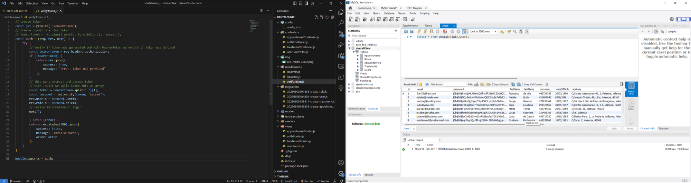

<h1 align="center">Welcome to my backend app</h1>

<h1 align="center">Fourth project in Geekshubs Academy FSD 04-2023</h1>



<details>
  <summary>Contet: 📝</summary>
  <ol>
    <li><a href="#target">Target</a></li>
    <li><a href="#about-the-project">About the project</a></li>
    <li><a href="#stack">Stack</a></li>
    <li><a href="#diagrama-bd">Diagrama</a></li>
    <li><a href="#installation">Installation</a></li>
    <li><a href="#project-structure">Project structure</a></li>
    <li><a href="#endpoints">Endpoints</a></li>
    <li><a href="#contributions">Contributions</a></li>
    <li><a href="#license">License</a></li>
    <li><a href="#webgrafia">Webgrafia</a></li>
    <li><a href="#acknowledgments">Acknowledgments</a></li>
    <li><a href="#contacts">Contacts</a></li>
  </ol>
</details>

## Target
This project required a functional API connected to a database with at least a one-to-many and a many-to-many relationship. Putting into practice the knowledge acquired mainly with sequelize - express.

## About the project
This project consisted of creating a web application for a dental clinic, in which we would have several features such as:
- user registration
- login access
- access to user profile
- profile modification according to permissions
- access to appointments and their modification
- view own appointments (user, doctor) 
- view all appointments according to permissions

I was investigating several apps of this style to see the structure and to be able to better apply all the points and functionalities. 

## Stack
<p>Technologies that has been used:</p>
<div align="center">
    <a href="https://expressjs.com/">
        
    </a>
    <a href="https://nextjs.org/">
        
    </a>
    <a href="https://developer.mozilla.org/es/docs/Web/JavaScript">
        
    </a>
    <a href="https://jwt.io/">
        
    </a>
    <a href="https://www.postman.com/">
        
    </a>
    <a href="https://www.mysql.com/">
        
    </a>
    <a href="https://www.github.com/">
        
    </a>
    <a href="https://git-scm.com/">
        
    </a>
    <a href="https://www.docker.com/">
        
    </a>
    <a href="https://www.sequelize.org/">
        
    </a>
</div>


## Diagrama BD


## Installation

1. Clone the project on your computer with git bash:
 `$git clone 'url-repository'`
2. Install all dependencies with the following command:
 ` $ npm i `
3. Conectamos nuestro repositorio con la base de datos
4.  Start the server with:
 ``` $ npm run dev ```
5. Connect the repository with the database with the following commands:
 ``` $ npx sequelize-cli db:create ``` 
 ``` $ npx sequelize-cli db:migrate ``` 
 ``` $ npx sequelize-cli db:seed:all ```

## Project structure
I have based on the creation of basic CRUD. This project has the following structure:
-	Index.js: This is the main file.
-	Config.
      - Config.json: This file is created automatically by sequelize and it managed the configuration to connect to the database.
-	Middlewares: This file manages common services, such as authentication through use of tokens to access API restricted zones.
      - isAdmin
      - isDoctor
      - verifyToken
-	db.js: Shows the configuration that must have into .env file that must be created for the application to work.
    ```PORT = PORT```
    ```JWT_SECRET = SECRET```
-	Router.js: This file manages the different paths that the application can have. He creado varias rutas para poder gestionar mejor la informacion
-	Views:
      - appointmentRoutes.js: In this file we manage the endpoints that point to that route.
      - authRoutes.js: In this file we manage the endpoints pointing to that path.
      - treatmentRoutes.js: In this file we manage the path /treatments and the endpoints pointing to that path.
      - usersRoutes.js: In this file we manage the endpoints that point to that path.
      
-	Controllers: There are controllers for each of the established routes.


## Endpoints
<details>
<summary>Endpoints</summary>

- AUTH
    - REGISTER

            POST http://localhost:9000/auth/register
        body:
        ``` js
            {
                "email": "prueba@prueba.com",
                "password": "1234",
                "firstName": "Prueba"
                "lastName": "Prueba"
                "document": "123456789"
                "address": "prueba"
                "telefonNumber": "123456789"
                "collegialNumber": "123456789"
            }
        ```

    - LOGIN

            POST http://localhost:9000/auth/login  
        body:
        ``` js
            {
                "email": "prueba@prueba.com",
                "password": "1234"
            }
        ```
</details>

- Create appointment:
    - Create appointment only for the logged in user through postman with POST option.

            POST:   http://localhost:9000/app
        body:
        ``` bash
        {
            "user_id1": "1",
            "user_id2": "1",
            "treatment_id": "3",
            "price": 10,
            "date": "2023-06-12"
        }
        ```
- Cancel appointment by Admin: 
    - CANCEL petition to delete any user appointments currently in the database.
  
            DELETE:   http://localhost:9000/appointments/:id
    You must indicate in the url the ID number of the appointment.
- Check all appointments by Admin: 
    - GET a list of all users' appointments.
  
            GET:   http://localhost:9000/appointments
- Check all appointments by Doctor: 
    - GET a list of all appointments.
  
            GET:   http://localhost:9000/appointments/doctorsAppointment
- Check personal appointment by User: 
    - GET a list of all appointments.

            GET:   http://localhost:9000/appointments/myAppointment
   
- Check profile: 
    - GET petition to see the user´s own profile.
  
            GET:   http://localhost:9000/users/profile
- Update profile: 
    - We update profile from the logged user.
  
            PUT:   http://localhost:9000/users/:id
        body:
    
        ``` bash
        {
            "email": "prueba@prueba.com",
            "password": "1234",
            "firstName": "prueba",
            "lastName": "prueba",
            "document": "123456789",
            "address": "c/tal, Valencia",
            "telefonNumber": "123456789",
            "collegialNumber": "123456789",
            "role_id": 2
        }
        ```
- Check all user profiles by Admin: 
    - GET petition to see the user´s profile, if you are logged like an Admin, will show all the information about the users.
  
            GET:   http://localhost:9000/users
- Check all user profiles by Doctor: 
    - GET petition to see the user´s profile, if you are logged like a doctor, will show only the relevant information about the users.
  
            GET:   http://localhost:9000/users/patients
- Delete treatment by Admin: 

            DELETE:   http://localhost:9000/treatments/:id
    You must indicate in the url the ID number of the treatment.
</details>

- Update user by Admin:
    - Update profile from the logged Admin.

            POST:   http://localhost:9000/users/:id
        body:
        ``` bash
        {
            "email":"",
            "password":"",
            "firstName":"",
            "lastName":"",
            "document":"",
            "address":"",
            "telefonNumber":"",
            "collegialNumber":"",
            "role_id":""
        }
        ```
- Delete user by Admin:
    - Delete user and all info by Admin.

            POST:   http://localhost:9000/users/:id

        is required user_id.

- Create treatment:
    - Create treatment by Admin

            POST:   http://localhost:9000/treatments
        body:
        ``` bash
        {
            "treatmentName": "",
            "description": "",
            "price": 10,
        }
        ```
</details>


## Contributions
Suggestions and contributions are always welcome.  

You can do this in two ways:

1. Opening an issue
2. Create a fork of the repository
    - Create a new branch
        ```
        $ git checkout -b feature/nombreUsuario-mejora
        ```
    - Make a commit with your changes 
        ```
        $ git commit -m 'feat: mejora tal parte'
        ```
    - Make push to the branch 
        ```
        $ git push origin feature/nombreUsuario-mejora
        ```
    - Open a Pull Request

## Licencia
This project is belonging to license Creative Commons Legal Code.

## Webgrafia:
To achieve my goal I have collected information from:
- [Sequelize documentation](https://sequelize.org/docs/v6/)
- [Repository GeeksHubs](https://github.com/GeeksHubsAcademy/2023_04_VAL_AUTH_SEQUELIZE)  

## Acknowledgments:

I thank my teachers for their time dedicated to this project:

- ***Dani***  
<a href="https://github.com/Datata" target="_blank"></a> 

- ***Jose***  
<a href="https://www.github.com/JoseMarin" target="_blank"></a>

- ***David***  
<a href="https://www.github.com/Dave86dev" target="_blank"></a>

- ***Mara***  
<a href="https://www.github.com/MaraScampini" target="_blank"></a> 

## Contacts
<a href = "mailto:anastasiakosovets@gmail.com"></a>
<a href="https://www.linkedin.com/in/anastasia-kosovets-00022917b/" target="_blank"></a> 
</p>